# CityHub Frontend

A React-based frontend for the CityHub project management platform, built with Vite and TypeScript.

## Demonstration

> These screenshots and videos demonstrate the core features of the CityHub Frontend. Useful if the website is not running.

### 0. Home Page


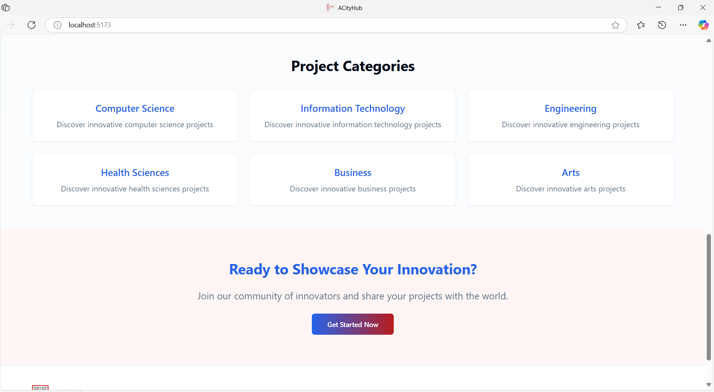
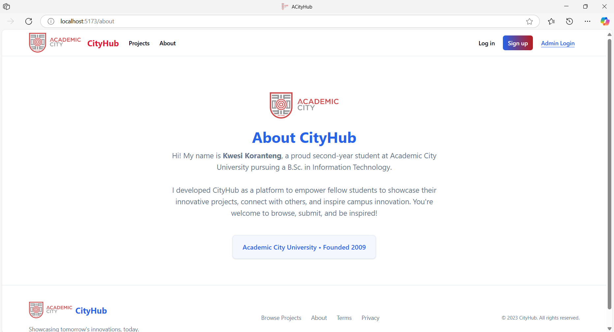

### 1. Login & Signup
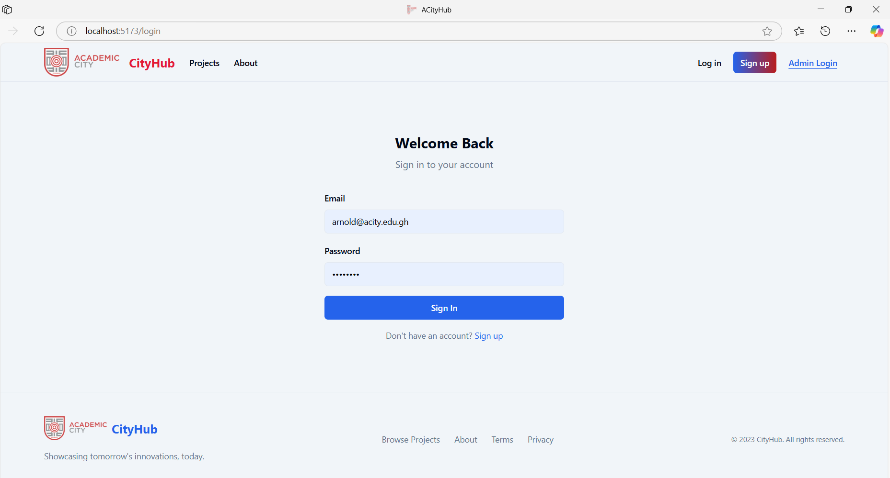 
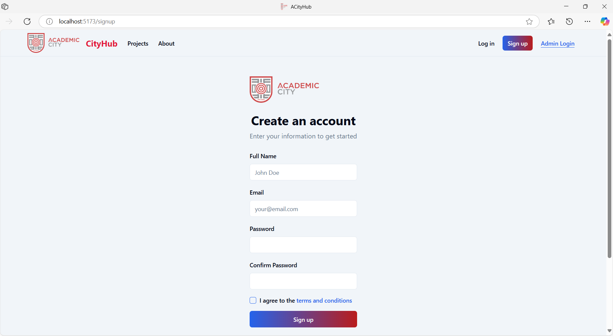 
 
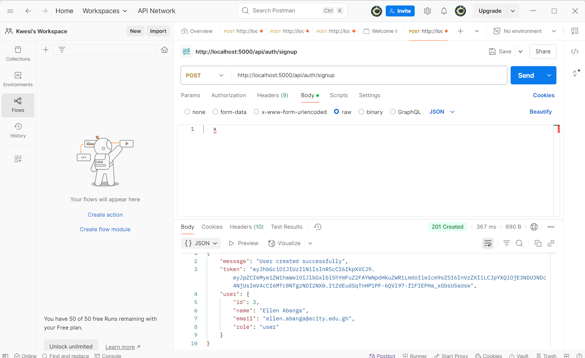 

### 2. Project Submission
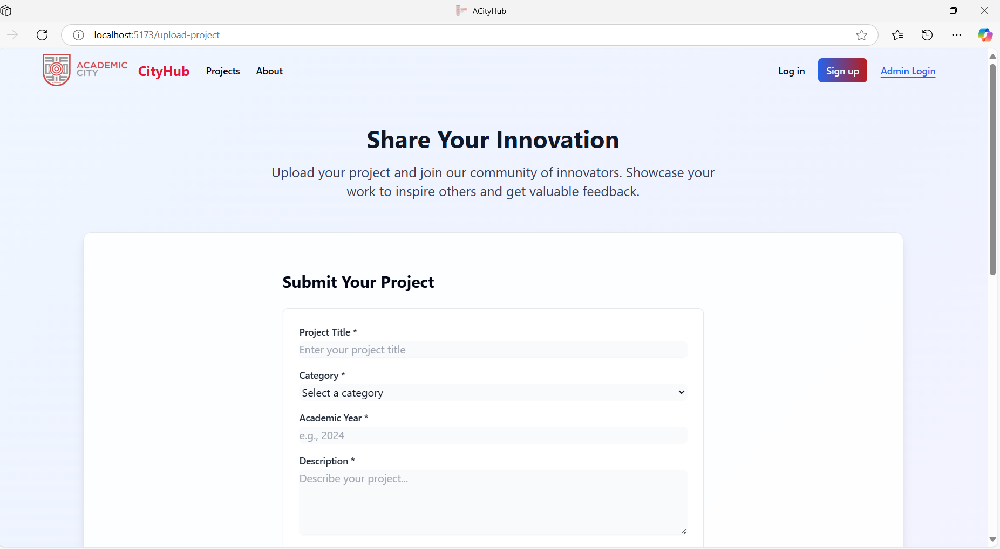
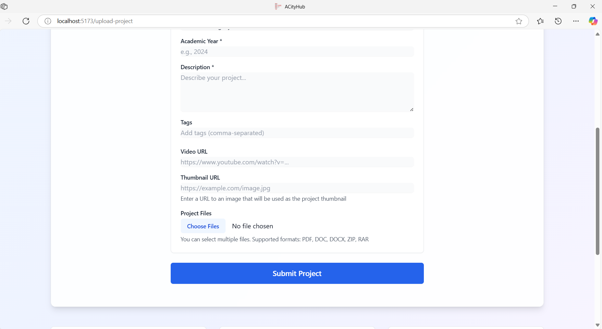
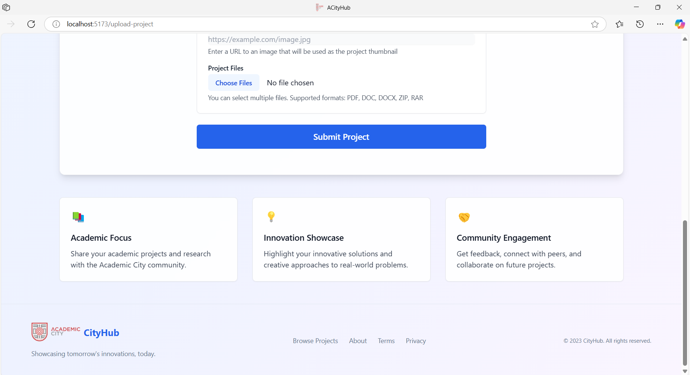
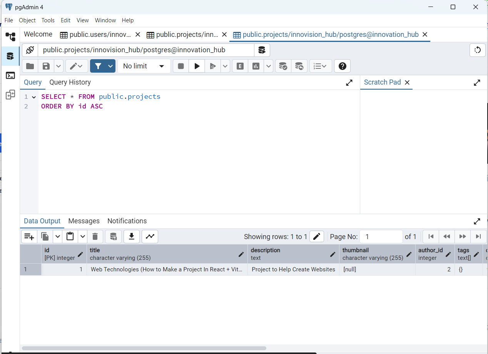
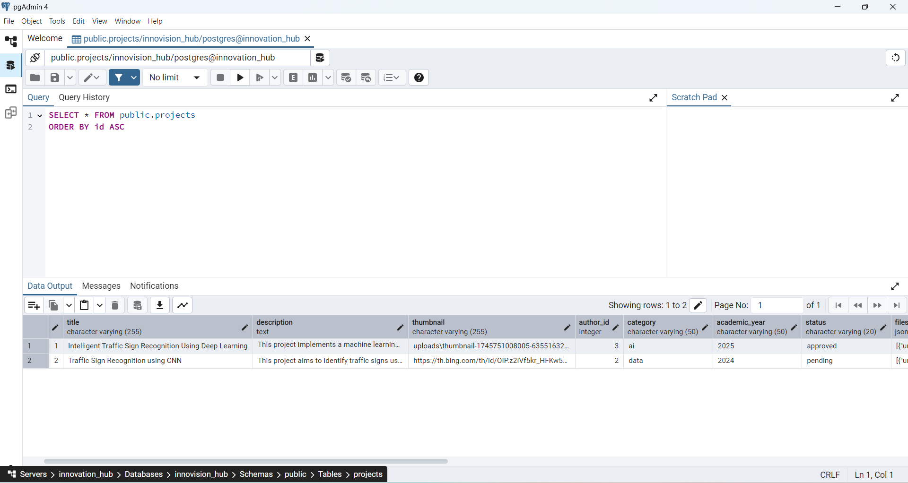

### 3. Project Browsing & Filters
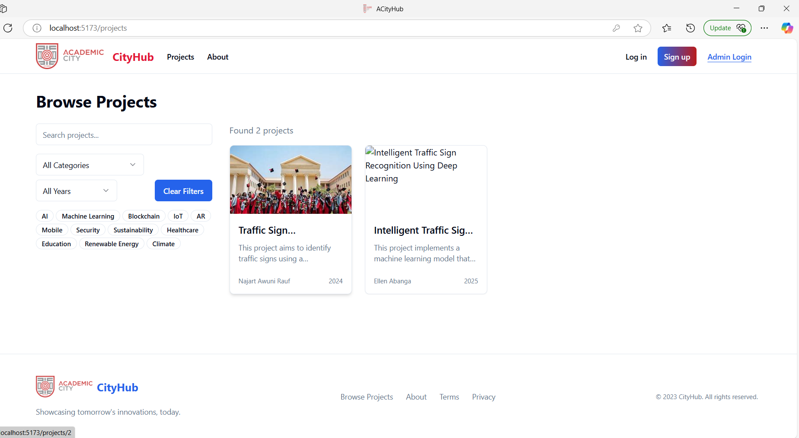

### 4. Project Details & Comments
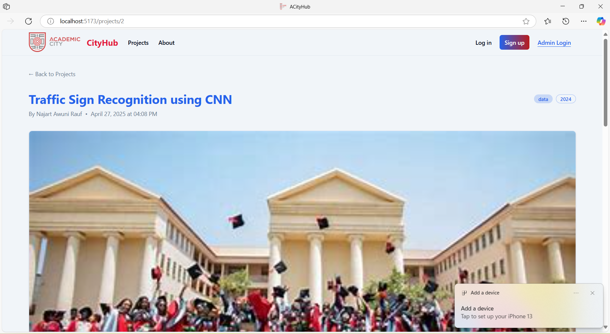

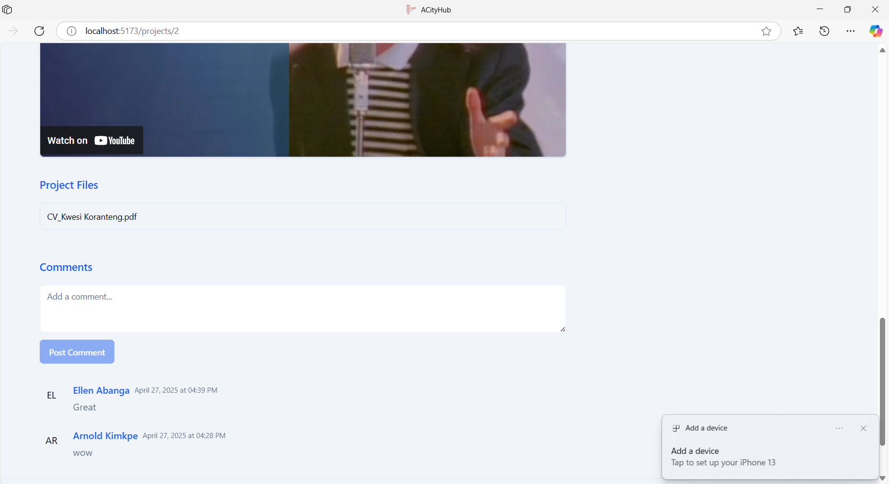

### 5. Admin Dashboard & Content Moderation
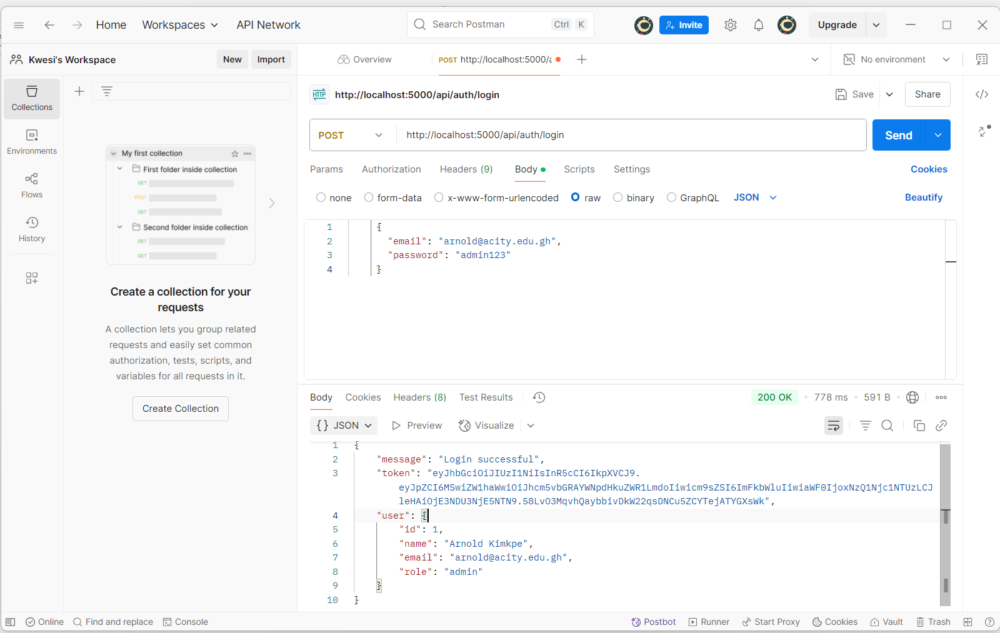
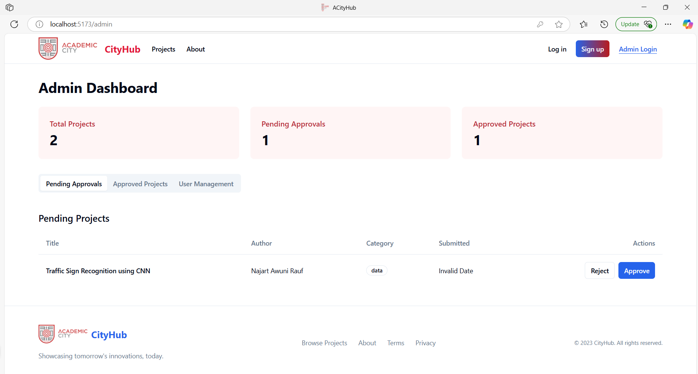
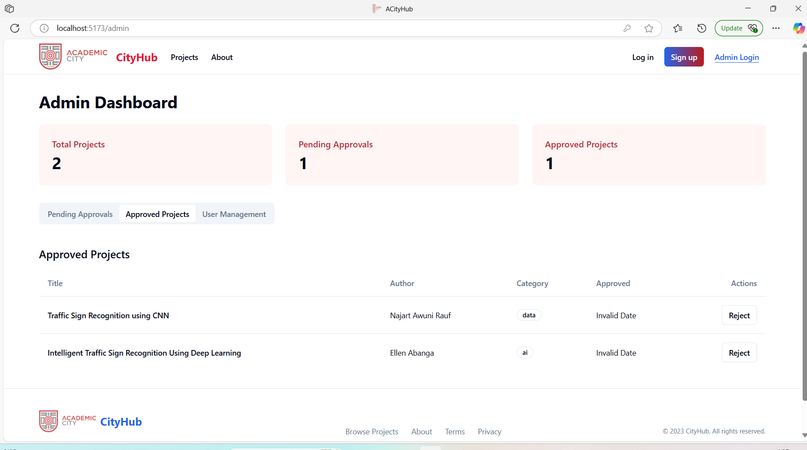
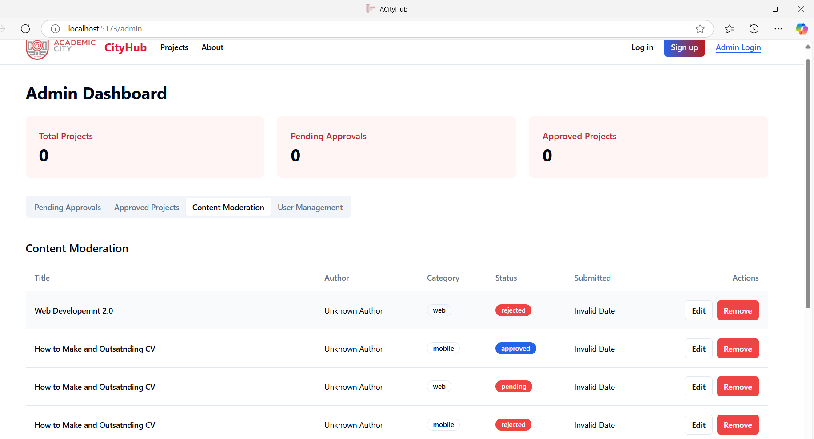


## Prerequisites

- Node.js (v16 or higher)
- npm or yarn
- Git


## Installation

1. Clone the repository:
```bash
git clone https://github.com/kwesi-koranteng/cityhub-frontend.git
cd cityhub-frontend
```

2. Install dependencies:
```bash
npm install
# or
yarn install
```

3. Create a `.env` file in the root directory:
```env
VITE_API_URL=http://localhost:5000
```

4. Start the development server:
```bash
npm run dev
# or
yarn dev
```

The application will be available at `http://localhost:5173`


## Project Structure

```
src/
├── components/     # Reusable components
├── pages/         # Page components
├── hooks/         # Custom React hooks
├── types/         # TypeScript type definitions
├── utils/         # Utility functions
└── App.tsx        # Main application component
```

## Technologies Used

- React
- Vite
- CSS
- React Router


